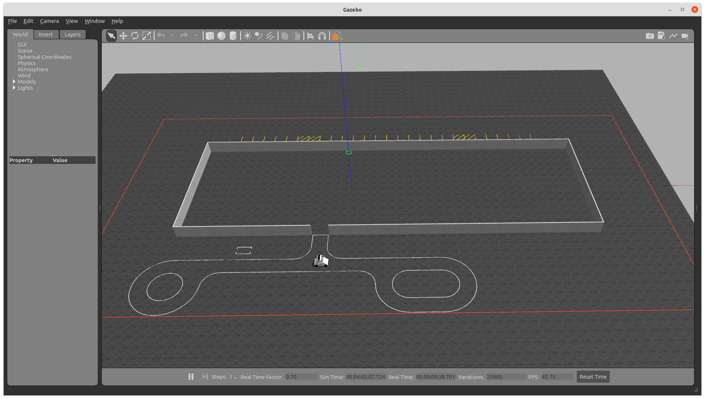

#### System: Ubuntu 20.04 + ROS Noetic (Gazebo 11)

#### Polaris GEM e2 Vehicle

  

#### Track1 Environment

$ source devel/setup.bash  
$ roslaunch gem_launch gem_init.launch world_name:="track1.world"  

$ source devel/setup.bash  
$ roslaunch gem_launch gem_sensor_info.launch  

  

  

##### Demo of Pure Pursuit Controller

$ source devel/setup.bash  
$ rosrun gem_pure_pursuit_sim pure_pursuit_sim.py  

  

##### Demo of Stanley Controller

$ source devel/setup.bash  
$ rosrun gem_stanley_sim stanley_sim.py  

  

  

### Track2 Environment

$ source devel/setup.bash  
$ roslaunch gem_launch gem_init.launch world_name:="track2.world" y:=-98.5  

  

### Example Environment

$ source devel/setup.bash  
$ roslaunch gem_launch gem_init.launch  

  

  

### Highbay Environment

$ source devel/setup.bash  
$ roslaunch gem_launch gem_init.launch world_name:="highbay_track.world" x:=-1.5 y:=-21 yaw:=3.1416  

  

  

